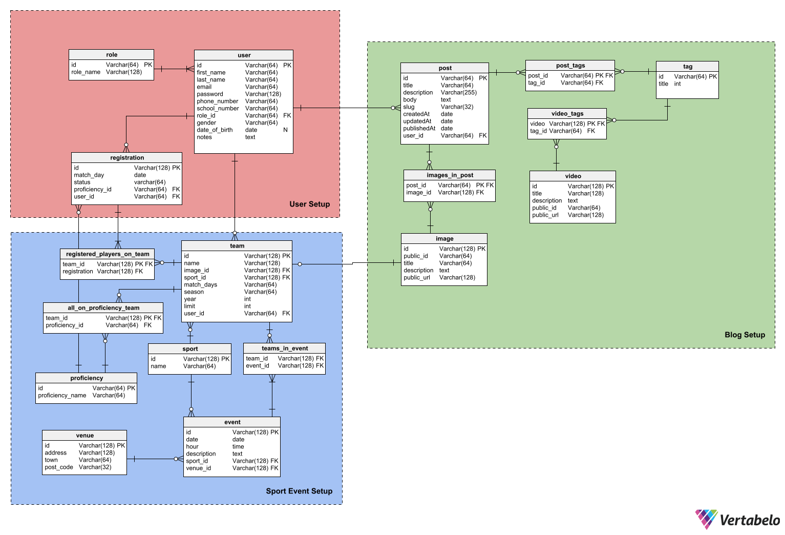
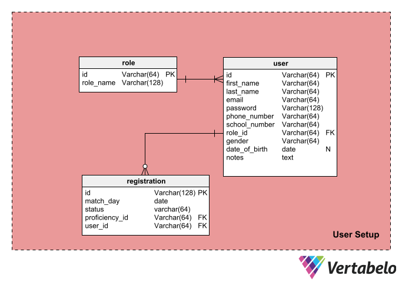
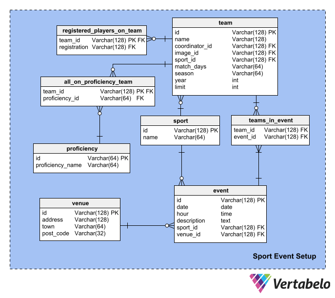
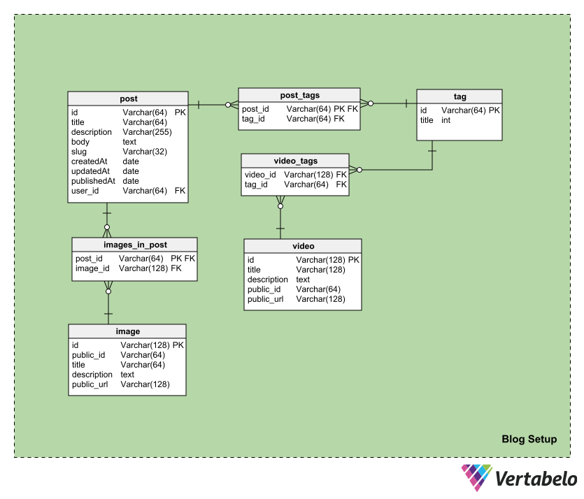

# NIC Athletics Data Model

_ER Diagram_

As NIC expands and adds dorms, they need to offer more activities for students to do in their free time. In this documentation we'll look at possible a data model that could power such an app.

Before I even started doing any research, I asked myself, “Why would NIC need such a website or team?” If I ignore all the administrative and logistic obstacles, I can see a big opportunity for NIC to expand and stand out from all Vancouver Island Colleges/Universities. Potentially, it can attract many new students that love sports. It can make a sports community around sport. It can connect newcomers, new students and other people, especially during the post-COVID time. It will make more straightforward access to sports for people that the NIC brought here.

Great, the biggest question is answered! I knew it wasn’t a revolutionary idea to make a college athletic team.

There are plenty of colleges that have a long tradition of their sports teams. Nevertheless, it wasn’t a disadvantage. So I started digging into schools' athletic teams and saw how huge those communities are! These websites contain scoreboards, reports, posts, videos, merchandise, fan zones, interviews, etc.

## The Idea

I pictured an app that would allow students (players) to sign up for teams they are interested in, watch upcoming matches and manage their registrations. The teams will be coordinated by NIC staff. All information such as match results and blog posts that can be used as a promo material will be displayed on the app by NIC staff. Through the app the students can manage their sport activities at NIC and stay informed about the past and upcoming events.

## The Data Model

The NIC Athletics data model consists of three modules

- `Blog`
- `Sport Event`
- `User`

## User

The `user` setup is the most important part of the model because it is focused on our target audience, the students. Also, this module is important because all the other data will be updated, created and deleted by users by [RBAC](https://ruleoftech.com/2022/using-casl-and-roles-with-persisted-permissions?utm_source=rss&utm_medium=rss&utm_campaign=using-casl-and-roles-with-persisted-permissions) approach.

- `user`
- `role`
- `registration`

The central table of this setup is the `user` table. Users are either players or coordinators. They are in separate tables to reduce redundancy by [normalization](https://www.guru99.com/database-normalization.html). The table will contain the following information about every user:

- `first_name` and `last_name` - The user's first and the last name.
- `email` - The email address that will allow us to reach the student.
- `password` - A hashed password of each user.
- `phone_number` - The phone number of the user.
- `school_number` - The number that helps us prove whether students are still part of NIC.
- `role_id` - Every user must have one of the following roles `student`, `coordinator`, `admin`, `super_admin`.
- `notes` - Notes might be used for notifying coordinators about some sort of disability.
- `date_of_birth` - It is aimed for students
- `gender`- We need to balance the teams because the leagues are mixed.

As mentioned, the `role` table stores only particular roles. The `role_name` attribute is UNIQUE. The list of roles might expand as the project grows.

The last table in this module is the `registration` table. Any student/player CAN register on a team that is available at NIC. For each registration, we will store:

- `match_day` - The student chooses what day they prefer to play based on the options.
- `status` - The status is going to be one of these three options: `registered`, `pending`, `canceled`. It will indicate whether the student has paid the fee or if they want to cancel their registration.
- `player_id` - Every registration must belong to only one user.
- `proficiency_id` - Every student chooses which the proficiency of the sport they are going to play: `recreational`, `intermediate`, `competitive`.

## Sport Event

Once we define who is going to play and who is going to coordinate we can design a module where all the events will be stored. There are eight tables:

- `team`
- `registered_players_on_team`
- `all_proficiencies_of_team`
- `proficiency`
- `sport`
- `teams_in_event`
- `event`
- `venue`

The central table in this module is the `event` table. This table handles two teams, location, and which sport.
[comment]: <The tables should be split into opponent teams and NIC teams since there no players on opponent's side and they don't have a coordinator>

- `date` - The date the event will start.
- `hour` - The time the event will start.
- `description` - The event might have a description that might serve as a report or promo.
- `sport_id` - The ID of the sport that the team will play, ex. `basketball`, `volleyball`, `soccer`.
- `venue_id` - The ID of the location where the teams will be performing.

The next table is the `all_proficiencies_of_team` table. This table collects all proficiency levels from the `proficiency_level` table and assign them to a team. Since a team can be mixed and have players from multiple proficiency groups, one team can have players from all proficiency levels.

The `team` table is one of the most crucial tables in this module and will shape our events. In this table are players that have signed up and the coordinator who will manage the infrastructure and communication around the events.

- `name` - The name of the team, ex. "NIC Men’s Basketball"
- `coordinator_id` - Every team needs to have a coordinator. For the start there will be only one.
- `image_id` - Each team will have an image that will be displayed on the app.
- `sport_id` - The ID of the sport that the team will play, ex. `basketball`, `volleyball`, `soccer`.
- `match_days` - The day of the week that the team will perform.
- `season` - The season the team will play, ex. `summer`, `fall`, `winter`.
- `year` - The year the team will play, ex. `2022`, `2023`, `2024`.

The last table is the `teams_in_event` table. Since every event has to have two teams this table will keep a reference of the teams and the event.

## Blog

This module will store details about the blog part of the app. There will be posts with optional images and tags. Similarly, there will be videos. The module consists of seven tables:

- `post`
- `post_tags`
- `tag`
- `image_in_post`
- `image`
- `video`
- `video_tag`

The most significant table is the `post` table. This table lists every blog post that creates a user and can have tags attached to it. These blog posts will serves as a way to get closer to new potential students. Current students might use it to practice their skills of writing. Also, a post can have multiple images to display.

- `title` - The title of the post that will be displayed as a link.
- `description` - A short description that might be used as a thumbnail.
- `body` - Each post is going to have a body that will describe tha whole structure of the post and its content.
- `slug` - Slug is going to store a string that will be displayed as a URL.
- `createdAt` - The date the post was created.
- `updatedAt` - The date the post was updated.
- `publishedAt` - The date the post was published.
- `user_id` - Every post must have a user who wrote it.

`image` table that effects other modules. This table is SST for images. All links to images are stored here. The images themselves will be stored in [Cloudinary](https://cloudinary.com/).

- `public_id` - The Cloudinary ID of the image.
- `title` - The title that describes the image.
- `description` - The description of the image if there is one. (optional)
- `public_url` - The url that will be publicly accessible.

Next, every video or image can have one or more tags. The `tag` table will store all tags that might be assigned and help filter the content.

The last table is the `video` table. This table lists every video. These blog posts will serves as a way to get closer to new potential students.

- `public_id` - The Cloudinary ID of the video.
- `title` - The title that describes the video.
- `description` - The description of the video if there is any.
- `public_url` - The url that will be publicly accessible.

