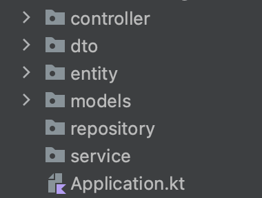

# bouceka Individual Development Project


## Motivation

For my independent project, I have chosen to create a Microservices app. I have never developed an entire app in microservices architecture, so it will be challenging. If you don't know what a microservices architecture is, [here](https://github.com/nic-dgl-204-fall-2022/aboucek-kotlin-research) is a link to my mini research that sums up the most important parts.

The app will be part of my personal project of fictional NIC Athletics. I have created a [database data schema](https://github.com/nic-dgl-204-fall-2022/bouceka-individual-dev-project/blob/main/ERD-model.md) that might help you picture the app's scope. However, I intend this to be more of a [POC](https://en.wikipedia.org/wiki/Proof_of_concept) than a project I would put into my resume.
### Technology used: [Kotlin](https://kotlinlang.org/), [Micronaut](https://micronaut.io/), [JavaScript](https://www.javascript.com/), [NATS](https://nats.io/), [PostreSQL](https://www.postgresql.org/) and more

## Study plan
I plan to create these three services.


| Goals            | Week |
| --------------------- | ---- |
| Set up environment    | 0    |
| Create first services | 1    |
| Integrate database    | 2    |
| Refactor Code         | 3    |

## Week 0
This week I focus on setting up an environment and creating three initial services, including technologies such as [Skaffold](https://skaffold.dev/), [Docker](https://www.docker.com/), and [Ingress](https://kubernetes.io/docs/concepts/services-networking/ingress/).
### Spent time: ~12 hours

## Challenges
- Creating Micronaut services and integrating them with Skaffold and Docker
- Designing the structure of the services
- I tried to implement Ktor as well. It took too much time to fix bugs.
## Progress
Micronaut has a pretty well-documented process of how to implement Skaffold. On the other side, implementing Docker went remarkably worse. I use Grandle, and in the documentation, Maven solution was shown. It took me a couple of hours to find the right solution. After implementing both, I could implement Ingress, which works like a load balancer (It is not!). Anytime a client requests the server, Ingress points to the appropriate service based on the URL. I also implemented auto-deployment to Google Cloud by Skaffold. You can see that in `skaffold-gcr.yml`. However, the project will be developed locally because Google Cloud is too expensive to maintain.

Suppose you have the same local environment set up as I do, meaning having installed Ingress, Skaffold, and Docker globally. You can quickly run all services at once just by running this command.
```bash
skaffold dev
```

## Week 4 - Branch name (feature/week-4)
This week I focus on improving the Micronaut services and creating first classes and packages that are going to shape the services. Also, I will prepare the environment for implementing databases. It will result in the first CRUD operations.
### Spent time: ~9 hours

## Challenges
- Creating relations between classes like domain entities or models
- Implementing Put operation and DTO
- Creating appropriate folder structure
## Progress
I have created a folder structure for each service. We have packages such as `Controller`, `DTO`, `Entity`, `Models`, `Repository`, and `Service`. A controller is will have files providing endpoints and filter requests with middleware (I will implement it later). [DTOs](https://micronaut-projects.github.io/micronaut-data/latest/guide/#dto) (Data Transfer Object) will be objects that define how the data will be sent over the network. Entities are going to map the tables that we will have in our database. In models is going to be stored data classes that shape the objects (It might be renamed to `Types`). In repositories, we will access data in the repository. Services will handle our business logic.



## What did I learn?
Very slowly I am picking up this framework and implementing Kotlin language for using backend API service.
I have learned the following:
- How to return data after a GET request.
```kotlin
@Controller("/api/registration")
class RegistrationController {

	var userData: User = User("1", "John", "Doe", "john@doe.com", "password", "123456789", "123456", "Player")
	val playerData = Player("1", "", "male", userData)
	val regitrationList = listOf<Registration>(Registration("1", "Tuesday", "Registered", "Competitive", playerData))

	@Get
	fun findAll(): List<Registration> {
		return regitrationList
	}

	@Get("/{id}")
	fun findById(@PathVariable id: String): Registration? {
		return regitrationList.find { it.id == id }
	}
}
```
- How to create data classes that will shape objects we will use such as `User`, `Player`, `Team`, etc.

```kotlin
data class User(
	val id: String,
	val firstName: String,
	...
	val userRole: String
)
```
```kotlin
data class Registration(
	var id: String,
	val matchDay: String,
	...
	val Player: Player,
)
```

## Potential Improvements
- I have implemented temporary static data that response from the controller. This should be improved by implementing database.
- In controllers of both services are missing PUT and DELETE operations. It took me a little bit more reading of JDBC and Micronaut documentation. The answer is [here](https://micronaut-projects.github.io/micronaut-data/latest/guide/#dto). I will fix it the following week.
- Folder structure might change, meaning change name into Pascal case.
- Refactor code. Remove and re-consider duplicity of the model classes.
